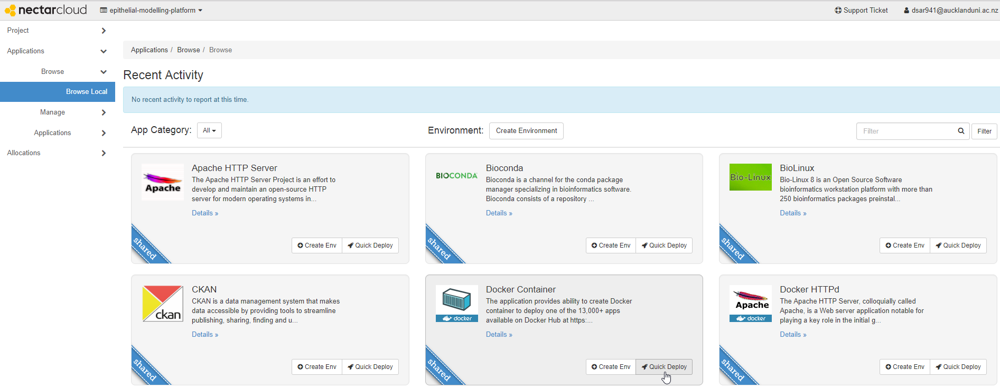
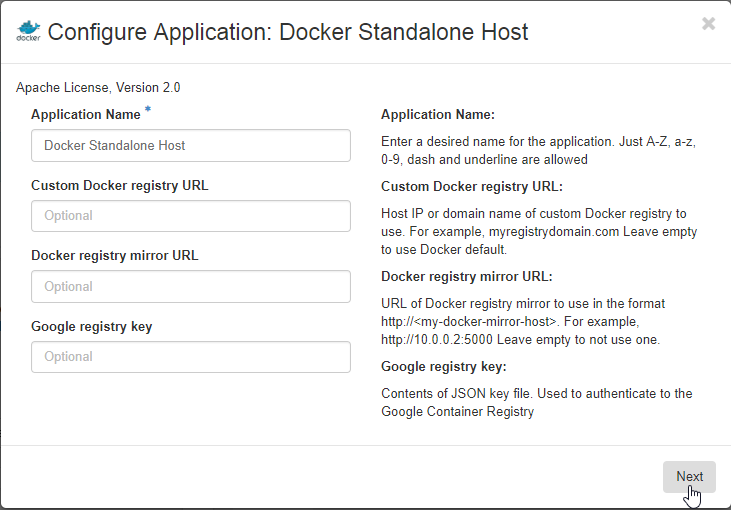
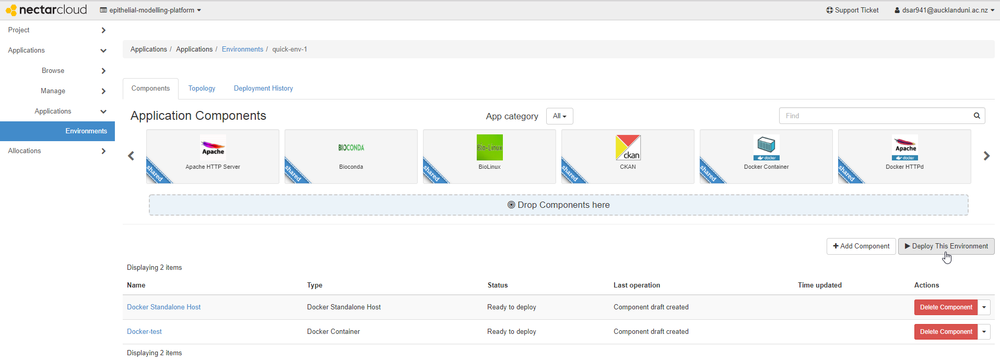
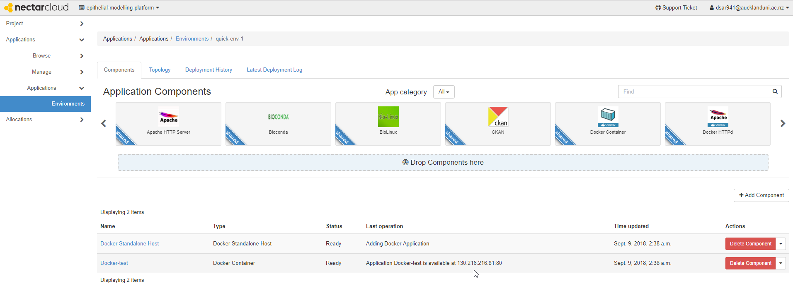

### Model Verification (MV)
Model Verification is a web-based platform for testing the [Epithelial Modelling Platform (EMP)](https://github.com/dewancse/epithelial-modelling-platform). It allows users to discover [SED-ML](http://sed-ml.org/) based annotation (dummy data at the moment) and to find similarities between the assembled model on the EMP and the annotated models in [PMR](https://models.physiomeproject.org). This tool is deployed at this address: http://130.216.216.60.

### Installing MV
This tool makes use of webservices provided by [PMR](https://models.physiomeproject.org) as well as several services from the [European Bioinformatics Institute (EBI)](https://www.ebi.ac.uk/services). In oder to develop web applications which make use of services in this way, it is best to make use of a reverse proxy to ensure the web application plays nicely with modern web browsers. In this project, we use a Docker-based [NGINX](http://nginx.org/) reverse proxy for this purpose, which makes it reasonably easy to get this demonstration up and running locally as well as deploying it on various cloud platforms.

If you have Docker and git installed on your machine, then the following should get you up and running:
```
git clone https://github.com/dewancse/model-verification
docker build -f Dockerfile -t unique-name/mdt-nginx .
docker run -d -p 80:80 -p 8000:8000 unique-name/mdt-nginx
```
Here MV is running at port 80 and machine learning server is running at port 8000. Due to have technical issues, users have to login to the docker container and manually execute the python script in the background to initiate nginx and python server. Note that python server receives the assembled models, which are visualized on the modelling platform of the EMP, and then performs model composition.
```
docker ps (to see the container_id)
docker exec -it container_id /bin/sh
python3 severML.py &
enter and exit 
```
And then http://localhost:80 should work.

### MV workflow

#### Search Model
`SEARCH MODEL` allows users to select a model from the dropdown menu. This will display two things: exact similarity and EBI similarity. Exact similarity is calculated based on the semantic annotation with biological information of each model, whereas EBI similarity is calculated by the [Clustalo Omega](https://www.ebi.ac.uk/Tools/msa/clustalo/) webservice at the EBI based on the protein sequences provided by this platform.

Presented in the screenshot below is an example of finding exact similarity and EBI similarity of models with respect to the selected model, `weinstein_1995.cellml`, from the dropdown menu. The similarity score demonstrates how similarity they are with respect to the `weinstein_1995.cellml` model in a scale of 1 for exact similarity and 100 for EBI similarity.

 
*A screenshot illustrating an example MV session, where the user has selected "weinstein_1995.cellml" model from the dropdown menu.*

Presented in the screenshot below demonstrates exact similarity between `weinstein_1995.cellml` and `weinstein_1995-human-baso.cellml` with distinct color based on the semantic annotation with biological information.

 
*A screenshot illustrating an example MV session (top two results for convenience), where the user has clicked on "weinstein_1995.cellml" and "weinstein_1995-human-baso.cellml".*

#### Modelling Platform
Following screenshoot illustrates an instance of the generated models’ component with circles, polygons and line with arrows. This platform consists of three membranes: apical, basolateral and capillary; and five compartments: luminal, cytosol, paracellular pathway, interstitial fluid and blood capillary. Each of these has been depicted with a unique color on the top-right corner of the platform.

Solutes of concentrations float within a specific compartment and solutes of fluxes have been placed on either apical, basolateral, or capillary membrane based on the annotated information in PMR. For example, presented below in the screenshot, flux of Na+ and flux of Cl- are flowing from luminal to cytosol compartment across apical membrane and through NaCl cotransporter. In order to distinguish physical entities and processes, we have represented them with the following shapes:
- `single fluxes` and `cotransporters` with `circles`
- `channels` with `polygons`
- `diffusive fluxes` in the paracellular pathway with a `text` and an `arrow`. 

For our purpose, we have considered the models presented below in the screenshot as a starting point of the Model Verification platform. For details, please navigate to the [Epithelial Modelling Platform](https://github.com/dewancse/epithelial-modelling-platform#epithelial-modelling-platform-emp). 

 
*A screenshot illustrating an example [Epithelial Modelling Platform](https://github.com/dewancse/epithelial-modelling-platform#epithelial-modelling-platform-emp) session, where the user has visualised models for model construction.*

#### Search Protocol
`Search Protocol` allows users to select some predefined protocols from the drop down menu, which are reproduced from the reference published articles in peer review journals

Presented below in the screenshot demonstrates the effect of external pH on sodium influx.


*A screenshot illustrating an example MV session, where the user has selected "external pH vs sodium flux" protocol.*

Presented below in the screenshot demonstrates how similar a model's simulated result with respect to an experimental data (dummy data at the moment).


*A screenshot illustrating an example MV session, where the user has selected "experimental" protocol with a view to displaying similarity of models' simulated experiments with respect to an experimental data (dummy data at the moment).*

#### Model Similarity via Spiral or Radar Chart
We have demonstrated model similarity feature via a radar chart. In the chart, each node represents a protein ID of the assembled epithelial model, as presented below in the screenshot. The source code of this radar chart has been adjusted from the blog [Making the d3.js radar chart look a bit better by Nadieh Bremer](https://www.visualcinnamon.com/2013/09/making-d3-radar-chart-look-bit-better.html).

 

*A screenshot illustrating similarity between the annotated models in PMR and the assembled epithelial model on the modelling platform. Each node in the chart represents a protein ID of the assembled epithelial model.*

Presented below in the screenshot demonstrated that orange TSC model is 97.41% similar to red TSC model due to different species.

 

*A screenshot illustrating a similarity score due to different species, although both of these models, indicated as orange and red, are TSC protein model.*

#### Model Similarity via Recreate Model
By using this feature, users can easily find similarity based on simulated experiments (dummy at the moment) between the protein IDs in the annotated models in PMR and the proteins IDs in the assembled epithelial model, as presented below in the screenshot.

 
*A screenshot illustrating model similarity feature based on simulated experiments (dummy at the moment) with respect to the protein IDs in the assembled epithelial model.*

## Docker Image in Nectar Cloud
We have deployed our Docker image to Nectar Cloud. In order to begin with the deployment process, please navigate to [Dashboard](https://dashboard.rc.nectar.org.au/auth/login/) in Nectar Cloud and provide login credentials. As a student at the University of Auckland, I have provided my login credentials, as illustrated below. Following screenshots are examples of our Docker image's deployment to Nectar. Please read texts below of each screenshot to know in details.  

 

*A login screen, where the user will choose either NZ or Australian.*


*A screenshot illustrating my federation and organization details.*



*An example Docker setup session, where the user will click "Quick Deploy" to begin with a session.*


*Fill out an application name, a docker image name from the Docker registry, and a port number for the docker container. Then click "Add Application".*



*Enter an application name and the remaining fields are optional. Then click "Next".*


*Choose the Ubuntu instance name from the dropdown menu, along with your key pair and availability zone. Follow this [key pair](https://support.ehelp.edu.au/support/solutions/articles/6000055376-launching-virtual-machines#Keypair) document to create a key pair, which will appear here under the key pair dropdown menu. Then click "Create".*


*Click "Create" to setup an environment for the Docker container.*



*Then click "Deploy This Environment" to begin with a deployment session.*



*Lastly, navigate to the IP address with the port number mentioned in the screenshot to visit the up and running docker image. Note that the user can apply for a DNS host name for this IP address to Nectar support team [Ask For Help](https://support.ehelp.edu.au/support/home).*

### Accessibility
The application is accessible by navigating::
```
  http://130.216.216.60
```

### Programming Language
- JavaScript
- SPARQL

### Limitations
We will implement Unit testing and Functional testing to make sure the code is functioning as expected. While the underlying tools are not specific to renal epithelial transport, the currently supported text-to-query mappings and recommender system are very specific to renal epithelial transport.

### List of contributors
- Dewan Sarwar - @dewancse
- David Nickerson - @nickerso

### Licencing
MIT license!

### Acknowledgements
This project is supported by the MedTech Centre of Research Excellence (MedTech CoRE), the Aotearoa Foundation, and the Auckland Bioengineering Institute.
